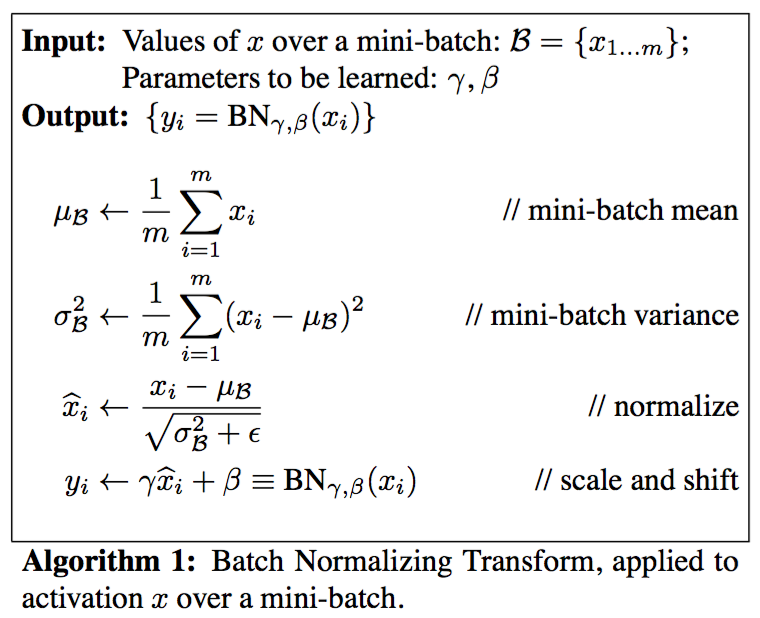
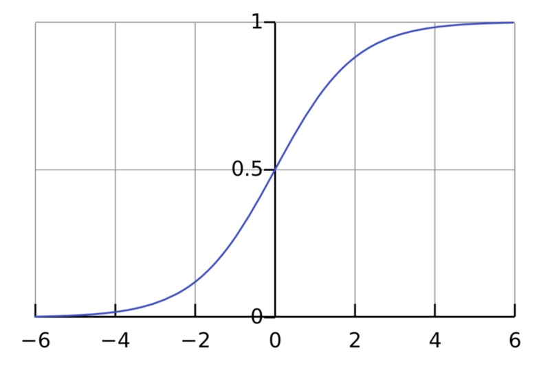
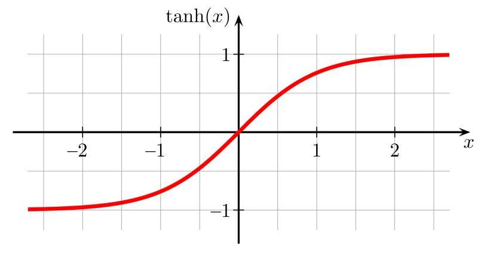

# 批量归一化（Batch Normalization）
训练深度神经网络可能非常耗时。但是可以通过消除梯度来显着地减少训练时间，这种情况发生在网络由于梯度（特别是在较早的层中的梯度）接近零值而停止更新。 

在CNN中，BN应作用在非线性映射前。在神经网络训练时遇到收敛速度很慢，或梯度爆炸等无法训练的状况时可以尝试BN来解决。另外，在一般使用情况下也可以加入BN来加快训练速度，提高模型精度 

批量标准化（Batch Normalization）也许是对付梯度消失和爆炸问题的最有力工具。 批量标准化的工作方式如下：对于给定层中的每个单元，首先计算z分数，然后在两个受过训练的变量γ和β应用线性转换。 批量标准化通常在非线性激活函数之前完成，但在激活函数之后应用批量标准也可能是有利的。 

σ激活函数和tanh激活函数存在梯度饱和的区域，其原因是激活函数的输入值过大或者过小，其得到的激活函数的梯度值会非常接近于0，使得网络的收敛速度减慢。传统的方法是使用不存在梯度饱和区域的激活函数，例如ReLU等。BN也可以缓解梯度饱和的问题，它的策略是在调用激活函数之前将Wx+b的值归一化到梯度值比较大的区域。BN应在激活函数之前使用。  

σ激活函数和tanh激活函数：

在反向传播过程中，梯度倾向于在较低层里变得更小，从而减缓权重更新并因此减少训练次数。 批量标准化有助于消除所谓的梯度消失问题。

在批量归一化的论文中 <https://arxiv.org/abs/1502.03167v3>，作者是娘BN放在非线性激活层的前面。目前在实践上，倾向于把BN放在ReLU后面。也有评测表明BN放ReLU后面效果更好。...（*-*）...玄学
