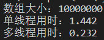

# 一个实现C++快排的算法


```cpp
#include <iostream>
#include <thread>
#include <ctime>

using namespace std;

#define N 10000000

void rand_nums(int* nums, int n)
{
    srand((unsigned int)time(NULL));
    for (int i = 0; i < n; ++i)
    {
        nums[i] = rand() % N;
    }
    
}

void quick_sort_sigle_thread(int* nums, int left, int right)
{
    if (left >= right) return;
    int i = left, j = right, base = nums[left];

    while (i < j)
    {
        while (i < j && nums[j] >= base) --j; //找一个比base小的
        while (i < j && nums[i] <= base) ++i; //找一个比base大的
        if (i < j) swap(nums[i], nums[j]);
    }

    swap(nums[left], nums[i]);
    
    quick_sort_sigle_thread(nums, left, i - 1);
    quick_sort_sigle_thread(nums, i + 1, right);
}

void quick_sort_multi_thread(int* nums, int left, int right)
{
    if (left >= right) return;
    int i = left, j = right, base = nums[left];

    while (i < j)
    {
        while (i < j && nums[j] >= base) --j; //找一个比base小的
        while (i < j && nums[i] <= base) ++i; //找一个比base大的
        if (i < j) swap(nums[i], nums[j]);
    }

    swap(nums[left], nums[i]);
  
    thread threads[2];

    if (right - left <= 100000)
    {   //小于10w用递归
        threads[0] = thread(quick_sort_sigle_thread, nums, left, i - 1);
        threads[1] = thread(quick_sort_sigle_thread, nums, i + 1, right);
    }
    else
    {
        //大于10w继续用多线程分割
        threads[0] = thread(quick_sort_multi_thread, nums, left, i - 1);
        threads[1] = thread(quick_sort_multi_thread, nums, i + 1, right);
    }
    
    for (int i = 0; i < 2; ++ i) threads[i].join(); 
}


void print_nums(int* nums, int end, int start = 0)
{
    for (int i = start; i < start +  end; ++i)
    {
        cout << nums[i] << ' ';
    }
    cout << endl;
}

int main()
{
    int *nums = new int[N];

    rand_nums(nums, N);
    // print_nums(nums, N);
    
    cout << "数组大小：" << N << endl;
    int start_time, end_time;
    start_time = clock();
    quick_sort_sigle_thread(nums, 0, N - 1);
    end_time = clock();

    cout << "单线程用时：" << (end_time - start_time) / 1000.0 << 's' << endl;

    // print_nums(nums, N);

    rand_nums(nums, N);

    start_time = clock();
    quick_sort_multi_thread(nums, 0, N - 1);
    end_time = clock();

    cout << "多线程用时：" << (end_time - start_time) / 1000.0 << 's' << endl;

    // print_nums(nums, N);

    delete[] nums;
    return 0;
}
```