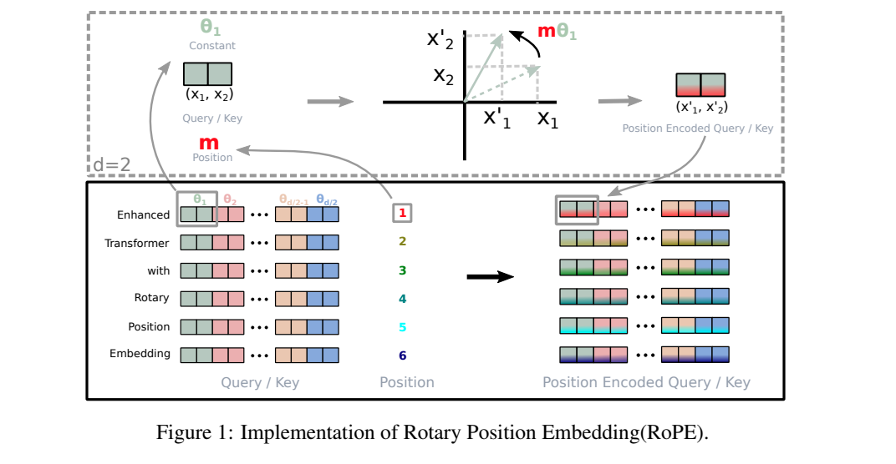
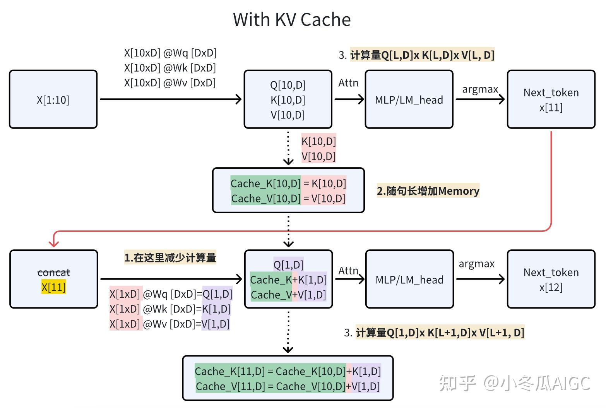

# LLama系列模型  
llama系列模型是闭源gpt3.5火爆之后开源的强大经典decoder-only模型，后面诞生的诸多llm多多少少都带有LLama的影子。

# LLama2模型结构的主要改进
## 1. 将Layer_norm更换为RMS_norm
在NLP模型中，归一化对模型训练过程中防止loss起飞有重要作用。
- 经典layer norm计算公式如下：
$$
    y = \frac {x - E(x)} {\sqrt{Var(x) + \epsilon}} * \gamma + \beta
$$

$$
    E(x) = \frac {1} {N} \sum^{N}_{i=0} {x_i}
$$

$$
    Var(x) = \frac {1} {N} \sum^{N}_{i=0}{(x_i - E(x))^2}
$$

其中,$γ$和$β$是可学习的参数。分母加上一个极小的数$ε$防止分母为0。   


- RMS norm其实是layer norm的变体，为了加快计算，省去了求均值的过程，也删除了偏置值$β$。

$$
    y = \frac {x} { \sqrt {Mean(x^2) + \epsilon}} * \gamma 
$$

$$
    Mean(x^2) = \frac {1} {N} \sum^{N}_{i=0}({x_i}^2)
$$
$γ$是可学习的参数
```python
class RMSNorm(torch.nn.Module):
    def __init__(self, dim: int, eps: float = 1e-6):
        super().__init__()
        self.eps = eps  # ε
        self.gama = nn.Parameter(torch.ones(dim)) #可学习参数γ
​
    def _norm(self, x):
        # RMSNorm
        return x * torch.rsqrt(x.pow(2).mean(-1, keepdim=True) + self.eps)
​
    def forward(self, x):
        output = self._norm(x.float()).type_as(x)
        return output * self.gama

```

## 2. Q在与K相乘之前，先使用RoPE进行位置编码


```python
# 作者：CodeLearner
# 链接：https://zhuanlan.zhihu.com/p/649756898

def precompute_freqs_cis(dim: int, end: int, theta: float = 10000.0):
    # 计算词向量元素两两分组以后，每组元素对应的旋转角度 
    # arange生成[0,2,4...126]
    freqs = 1.0 / (theta ** (torch.arange(0, dim, 2)[: (dim // 2)].float() / dim))
    # t = [0,....end]
    t = torch.arange(end, device=freqs.device)  # type: ignore
    # t为列向量 freqs为行向量做外积
    # freqs.shape = (t.len(),freqs.len()) #shape (end,dim//2)
    freqs = torch.outer(t, freqs).float()  # type: ignore
    # 生成复数
    # torch.polar(abs,angle) -> abs*cos(angle) + abs*sin(angle)*j
    freqs_cis = torch.polar(torch.ones_like(freqs), freqs)  # complex64
    # freqs_cis.shape  = (end,dim//2)
    return freqs_cis
​
def reshape_for_broadcast(freqs_cis: torch.Tensor, x: torch.Tensor):
    # ndim为x的维度数 ,此时应该为4
    ndim = x.ndim
    assert 0 <= 1 < ndim
    assert freqs_cis.shape == (x.shape[1], x.shape[-1])
    shape = [d if i == 1 or i == ndim - 1 else 1 for i, d in enumerate(x.shape)]
    # (1,x.shape[1],1,x.shape[-1])
    return freqs_cis.view(*shape)
​
def apply_rotary_emb(
    xq: torch.Tensor,
    xk: torch.Tensor,
    freqs_cis: torch.Tensor,
) -> Tuple[torch.Tensor, torch.Tensor]:
    # xq.shape = [bsz, seqlen, self.n_local_heads, self.head_dim]
    # xq_.shape = [bsz, seqlen, self.n_local_heads, self.head_dim//2 , 2]
    # torch.view_as_complex用于将二维向量转换为复数域 torch.view_as_complex即([x,y]) -> (x+yj)
    # 所以经过view_as_complex变换后xq_.shape = [bsz, seqlen, self.n_local_heads, self.head_dim//2]
    xq_ = torch.view_as_complex(xq.float().reshape(*xq.shape[:-1], -1, 2))
    xk_ = torch.view_as_complex(xk.float().reshape(*xk.shape[:-1], -1, 2))
    
    
    freqs_cis = reshape_for_broadcast(freqs_cis, xq_) # freqs_cis.shape = (1,x.shape[1],1,x.shape[-1])
    
    # xq_ 与freqs_cis广播哈达玛积
    # [bsz, seqlen, self.n_local_heads, self.head_dim//2] * [1,seqlen,1,self.head_dim//2]
    # torch.view_as_real用于将复数再转换回实数向量, 再经过flatten展平第4个维度 
    # [bsz, seqlen, self.n_local_heads, self.head_dim//2] ->[bsz, seqlen, self.n_local_heads, self.head_dim//2,2 ] ->[bsz, seqlen, self.n_local_heads, self.head_dim]
    xq_out = torch.view_as_real(xq_ * freqs_cis).flatten(3)
    xk_out = torch.view_as_real(xk_ * freqs_cis).flatten(3)
    return xq_out.type_as(xq), xk_out.type_as(xk)
# 精简版Attention
class Attention(nn.Module):
    def __init__(self, args: ModelArgs):
        super().__init__()
        self.wq = Linear(...)
        self.wk = Linear(...)
        self.wv = Linear(...)
        
        self.freqs_cis = precompute_freqs_cis(dim, max_seq_len * 2)
​
    def forward(self, x: torch.Tensor):
        bsz, seqlen, _ = x.shape
        xq, xk, xv = self.wq(x), self.wk(x), self.wv(x)
        xq = xq.view(bsz, seqlen, self.n_local_heads, self.head_dim)
        xk = xk.view(bsz, seqlen, self.n_local_kv_heads, self.head_dim)
        xv = xv.view(bsz, seqlen, self.n_local_kv_heads, self.head_dim)
         # attention 操作之前，应用旋转位置编码
        xq, xk = apply_rotary_emb(xq, xk, freqs_cis=freqs_cis)
        #...
        # 进行后续Attention计算
        scores = torch.matmul(xq, xk.transpose(1, 2)) / math.sqrt(dim)
        scores = F.softmax(scores.float(), dim=-1)
        output = torch.matmul(scores, xv)  # (batch_size, seq_len, dim)
  # ......
```

## 3. 引入KV Cache，并采用Group Query Attention


出处见图片水印。

```python

# 作者：CodeLearner
# 链接：https://zhuanlan.zhihu.com/p/649756898

def mha(x, c_attn, c_proj, n_head, kvcache=None):  # [n_seq, n_embd] -> [n_seq, n_embd]
    # qkv projection
    # when we pass kvcache, n_seq = 1. so we will compute new_q, new_k and new_v
    x = linear(x, **c_attn)  # [n_seq, n_embd] -> [n_seq, 3*n_embd]
    # split into qkv
    qkv = np.split(x, 3, axis=-1)  # [n_seq, 3*n_embd] -> [3, n_seq, n_embd]
    if kvcache:
        # qkv
        new_q, new_k, new_v = qkv  # new_q, new_k, new_v = [1, n_embd]
        old_k, old_v = kvcache
        k = np.vstack([old_k, new_k]) # k = [n_seq, n_embd], where n_seq = prev_n_seq + 1
        v = np.vstack([old_v, new_v]) # v = [n_seq, n_embd], where n_seq = prev_n_seq + 1
        qkv = [new_q, k, v]
```