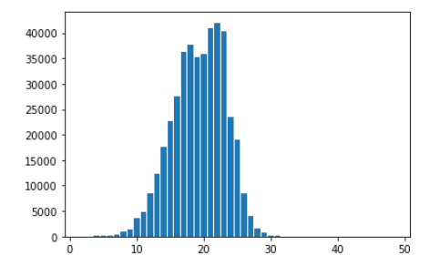
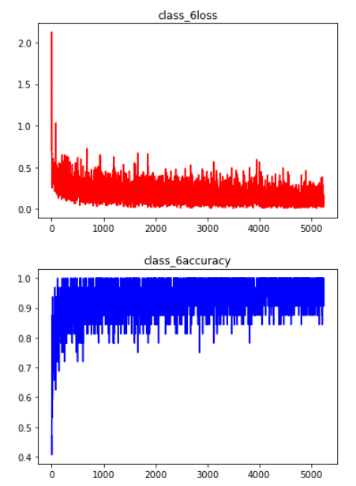
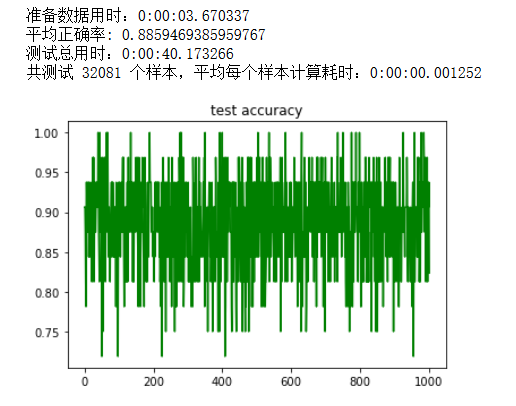

# 数据集：
新闻标题数据集，14个类，训练集共75万条数据。

## 解决思路：
使用“一对多”拆分策略：每次将一个类别作为正类（正样本），其余其他类别作为反类（负样本），产生N个二分类任务。
为什么不用“一对一”的拆分策略？一对一的拆分策略会产生 N ( N - 1 ) / 2 个分类任务，100个分类将会产生约5000个分类器，训练5000个分类器会花费大量时间，而“一对一”拆分将训练100个分类器，花费的时间更少。

## “一对多”策略产生的问题：
正负样本不均衡。当训练一个类别的时候，其余类别都是反类，产生了正负样本不均衡的问题。
解决方法：
每一类的训练数据中，正样本选N个，负样本从其余类别的样本中随机选N个样本。分批、分类别训练，随机取负样本，负样本尽可能多地包含所有其他类别。

## 字向量：
使用开源的基于人民日报语料、Word + Ngram训练的预训练词向量，包含1664K的字、词。每个字、词的维度是300。向量矩阵大小：972M

## 数据预处理：
数据集共包含14个类别，每个类别的样本从几万到二十几万不等，为了避免加载二十几万的正样本+二十几万的负样本造成内存爆炸，故限制每个类别的样本不超过5万条。
经过处理后，14个类的训练数据共 42 6208 条，测试数据 3 2081 条
统计句子长度，如下图。取句子最大长度为30，大于30的句子做截断处理，小于30的用0填充。


# 模型设计：
```python
BinaryClassifyModel(
  Conv1D(filters=196, kernel_size=4, strides=2, activation='relu')
  Conv1D(filters=64, kernel_size=3, strides=2, activation='relu')
  Dense(128, activation='relu')
  Dense(64, activation='relu')
  Dense(1, activation='sigmoid')
)
```
## 损失函数：二分类交叉熵
2层1维卷积+3层全连接，模型的最后输出的激活函数为`sigmoid`，`sigmoid`函数将输出映射到[0,1]，当`sigmoid`输出 $y>0.5$ 时，认为输入x属于当前分类器的类；当`sigmoid`输出 $y ≤ 0.5$ 时，认为输入x不属于该类别。
## 训练：
机器配置：CPU：i5-8300H；显卡：1050TI；内存：16G；显存：4G
```python
BATCH_SIZE = 32 #批次大小
EPOCH = 2 #训练轮次
LEARNING_RATE = 0.005 #学习率
```

- 使用Adam优化器
每个类训练完成后，将模型保存到 ./model_save/class_ + category_id 文件夹内，category_id 为分类id，从0到13，共14个分类。
42万训练数据，14个二分类器训练共用了15分49秒，平均每个分类器训练用时67秒。
训练过程中的平均正确率没有统计，下图展示类别6的在训练过程中的损失和正确率：


## 测试：
模型训练完成后会将模型的参数保存到文件中，测试时先从文件加载训练好的二分类模型，再让测试数据依次通过14二分类模型，记录下每个二分类模型的输出概率（由于使用了sigmoid函数，输出在[0,1]之间），哪个二分类模型的输出概率最大，则认为测试样本属于该类。
测试数据如下图所示，平均正确率：88.59%，3万条测试数据共花了40秒，平均每个样本通过14个二分器用时1.3毫秒。


# 结论：
不管从训练用时、模型计算用时、模型大小等方面考虑，使用二分类实现多分类对文本分类可行。新增加一个分类，只需要新添加一个二分类器即可，当分类更改时对二分类器做微调也比较方便，不改变模型的输入输出大小。不像传统做法：只有一个模型，模型参数巨大，新增或者删除一个分类，要对模型最后的全连接层调整，以调整输出的大小。对于多标签分类，每个标签训练一个二分类器即可解决。对于长文本，可以用自注意力层替换第一层卷积层，最大文本长度可以支持1000以上。
- 缺点：需要大量的训练数据。

## 附代码
```python
import tensorflow as tf
import numpy as np
from matplotlib  import pyplot as plt
from gensim.models import KeyedVectors
import datetime

TRAIN_TEXT = './data/新闻标题分类Train.txt'
TEST_TEXT = './data/新闻标题分类Test.txt'

#人民日报预训练字向量
EMBEDDINGD_DIR = '../Word_Embeddings/sgns.renmin.bigram-char'
embedding = KeyedVectors.load_word2vec_format(EMBEDDINGD_DIR, binary=False,limit=50000)

def word_to_vector(words_array, words_embedding, max_len=30):
    '''
    将字转为字嵌入，words_array为一维数组，每个元素是一句话
    '''
    words_vector = []
    i = 0
    for sentence in words_array:
        if max_len != None:
            current_vector = np.zeros((max_len,300),dtype = np.float32)
        else:
            current_vector = np.zeros((len(sentence), 300), dtype = np.float32)
        
#         print(current_vector.shape)
        
        index = 0
        for word in sentence:
            try:
                current_vector[index] = words_embedding[word]
                index += 1
                if index == max_len:
                    break
            except:
                #可能会出现某个字在embedding中不存在的情况，则跳过这个字
                continue
        #end for
        words_vector.append(current_vector)
#         print(words_vector.shape)
#         break
    #end for
    
    return np.array(words_vector)
    
def read_data(train_text):
    '''
    读取训练文件，并划分训练集和测试集
    '''
    category = []
    news_data = []
    news_label = []
    
    with open(train_text,'r', encoding='utf-8') as f:
        lines = f.readlines()
        
    current_category = int('0')
    category.append([current_category, '财经'])
    
    #['0', '财经', '上证50ETF净申购突增\n']
    
    #每个类别保留的最大样本数目，防止内存爆炸
    count = 0
    max_keep = 50000
    
    for line in lines:
        
        line = line.strip().split('\t')
        
        cate = int(line[0])
        
        #还是当前类，但是count已经到达最大max_keep，不处理
        if cate == current_category and count >= max_keep:
            continue
        
        if cate != current_category:
#             print(count)
            current_category = cate
            category.append([current_category, line[1]])
            count = 0
            
        news_data.append(line[2])
        
        news_label.append(cate)
        
        count += 1
        
    news_data = np.array(news_data)
    news_label = np.array(news_label)
    
    #划分训练集和测试集
    n = len(news_data)
    sample_index = np.random.permutation(n).astype(np.int32)
    train_index = sample_index[ : int(n * 0.93)]
    test_index = sample_index[int(n * 0.93) : ]
    
    train_data = news_data[train_index]
    train_label = news_label[train_index]
    
    test_data = news_data[test_index]
    test_label = news_label[test_index]
    
    return np.array(category), train_data, train_label, test_data,test_label

#取出第一类作为正样本,再从其余类中取出负样本
def get_category_sample(category_id, data, label, batch_size=None):
    '''
    取出一个类作为正样本，再从其余类中随机选出和正样本数量相当的负样本，尽可能包含所有类
    '''
    pos_sample_index = []
    other_sample_index = []
    
    n = len(label)
    
    for index in range(n):
        if category_id == label[index]:
            pos_sample_index.append(index)
        else:
            other_sample_index.append(index)
    
    #正样本个数
    pos_n = len(pos_sample_index)
    
    #随机取跟正样本数量一样的负样本
    neg_sample_index = np.random.choice(other_sample_index, size=pos_n, replace=False)
    
    #将正负样本的index拼接并打乱顺序
    sample_index = np.concatenate((pos_sample_index, neg_sample_index)).astype(np.int32)
    np.random.shuffle(sample_index)
    
    #用sample_index取出样本
    n = len(sample_index)
    train_index = sample_index[ : int(n * 0.9)]
    test_index = sample_index[int(n * 0.9) : ]

    train_data = data[train_index]
    train_label = label[train_index]
#     print(train_index.shape)
    test_data = data[test_index]
    test_label = label[test_index]
    
    #将当前类的label设置为1，其他类设置为0
    def change_label(lab):
        n = len(lab)
        for i in range(n):
            if lab[i] == category_id:
                lab[i] = 1
            else:
                lab[i] = 0
        return lab
    
    train_label = change_label(train_label)
    test_label = change_label(test_label)
    
    return train_data, train_label, test_data, test_label    

#统计标题长度
def count_len(data):
    
    max_len = 0
    n = len(data)
    
    len_dict = {}
    
    for i in range(n):
        sentence_len = len(data[i])
        
        if sentence_len in len_dict:
            len_dict[sentence_len] += 1
        else:
            len_dict[sentence_len] = 1
    
    lengths = [key for key in len_dict.keys()]
    lengths.sort()
    
    count = [len_dict[key] for key in lengths]
    
    plt.bar(lengths, count)
    plt.show()

#二分类模型
class BinaryClassifyModel(tf.keras.Model):
    def __init__(self,filters=196, kernel_size=4):
        super().__init__()
        
        self.conv1 = tf.keras.layers.Conv1D(filters, kernel_size, strides=2, activation='relu')
        self.maxpool1 = tf.keras.layers.MaxPool1D(strides=2)
        
        self.conv2 = tf.keras.layers.Conv1D(filters=64, kernel_size=3, activation='relu')
        self.maxpool2 = tf.keras.layers.MaxPool1D(strides=2)
        
        self.fc1 = tf.keras.layers.Dense(128, activation='relu')
        self.fc2 = tf.keras.layers.Dense(64, activation='relu')
        self.fc3 = tf.keras.layers.Dense(1, activation='sigmoid')
        
        
    def call(self, inputs):
        #卷积层
        x = self.conv1(inputs) #shape: batch_size,new_steps(stpe / strides (- 1)), filters ,(batch_size, 14 ,196)
        x = self.maxpool1(x) #(batch_size,7, 196)
        x = self.conv2(x) #(batch_size,5, 64)
        x = self.maxpool2(x) #(batch_size,2, 64)

        
        #将三维向量reshape为二维矩阵，用于全连接层输入
        x = tf.reshape(x, (tf.shape(x)[0], -1)) #(batch_size, 128)
#         print(x.shape)
        
        #全连接层
        x = self.fc1(x)
        x = self.fc2(x)
#         output = tf.nn.softmax(self.fc3(x))
        output = self.fc3(x)
        
        return tf.reshape(output, [output.shape[0]])

def train_a_classifier(train_vector,train_label, model, save_dir,learning_rate=0.001, msg=''):
    '''
    训练一个模型，
    '''
    
    train_iterator = tf.data.Dataset.from_tensor_slices((train_vector, train_label)).batch(BATCH_SIZE).repeat(EPOCH)

    optimizer = tf.keras.optimizers.Adam(learning_rate=learning_rate)
    check_point = tf.train.Checkpoint(binary_model = model)
    checkpoint_manager = tf.train.CheckpointManager(check_point, directory=save_dir, max_to_keep=1)
    acc_ary = []
    loss_ary = []
    steps = []
    
    with tf.device('/gpu:0'):
        for step,(x, y) in enumerate(train_iterator):
            with tf.GradientTape() as tape:
             
                y_pred = model(x)
                
                #损失函数,二分类交叉熵
                loss = tf.keras.losses.binary_crossentropy(y_pred=y_pred, y_true=y)
               
                loss = tf.reduce_mean(loss)
                
                #计算正确率
                y_pred = tf.where(y_pred < 0.5, x=tf.zeros_like(y_pred), y=tf.ones_like(y_pred))
                y_pred = y_pred.numpy().astype(np.int32)
      
                train_acc = np.sum(y_pred == y) / y.shape[0]
#                 print(y_pred)
#                 print(y)
#                 print(train_acc)
#                 break
                #统计损失和正确率，用于画图
                loss_ary.append(loss.numpy())
                acc_ary.append(train_acc)
                steps.append(step)
                
                grads = tape.gradient(loss, model.variables)
                optimizer.apply_gradients(grads_and_vars= zip(grads, model.variables))
                
                if step % 200 == 0:
                    print("{}  setp: {} , loss : {} , train acc : {}".format(msg, step, loss, train_acc))
                
    
        plt.plot(steps, loss_ary, c='r')
        plt.title(msg + 'loss')
        plt.show()
        
        plt.plot(steps, acc_ary, c='b')
        plt.title(msg + 'accuracy')
        plt.show()

        path = checkpoint_manager.save()

        print('保存模型到：{}'.format(path))
        
        return model

def train_all_classifier(category, train_data, train_label):
    '''
    训练所有分类器
    categroy：二维数组，第一列为category_id, 第列为id对应的名称
    train_data,train_laber：所有类别的训练数据和标签，都是一维数组，一个元素为一句话或一个标签
    '''
    models_list = []
    models_save_dir = []
#     print(train_data.shape)
    
    for cate in category:
        model = BinaryClassifyModel()
        
        category_id = int(cate[0])
        print('当前训练：{}'.format(category_id))
        
        start_time = datetime.datetime.now()
        
        data_train, label_train, data_test, label_test = get_category_sample(category_id, train_data, train_label)
        train_vector = word_to_vector(data_train, embedding, max_len=30)
        print('准备数据用时：{}'.format(datetime.datetime.now() - start_time))
        
#         test_vector = word_to_vector(data_test, embedding, max_len=30)
        
        #MODEL_SAVE_DIR命名规则，MODEL_SAVE_DIR + category_id，如./model_save/class_1，./model_save/class_2
        model = train_a_classifier(train_vector, label_train, model,save_dir=MODEL_SAVE_DIR + str(category_id), learning_rate=LEARNING_RATE, msg='class_'+str(category_id))
        
        print('训练用时：{}'.format(datetime.datetime.now() - start_time))
        
        models_list.append(model)

def test_all_classifier(category, test_data, test_laber, need_load_checkpoint=False, model_ary=None):
    '''
    测试所有分类器的性能
    '''
    start_time = datetime.datetime.now()
    test_vector = word_to_vector(test_data, embedding, max_len=30)
    print('准备数据用时：{}'.format(datetime.datetime.now() - start_time))
    
    #从文件中加载训练好的模型
    if need_load_checkpoint:
        model_ary = []
        for cate in category:
            category_id = int(cate[0])
            model = BinaryClassifyModel()
            check_point = tf.train.Checkpoint(binary_model = model)
            check_point.restore(tf.train.latest_checkpoint(MODEL_SAVE_DIR + str(category_id)))
            model_ary.append(model)
            
    start_time = datetime.datetime.now()
    test_iterator = tf.data.Dataset.from_tensor_slices((test_vector, test_label)).batch(BATCH_SIZE)
    
    acc_ary = []
    count = 0
    with tf.device('/gpu:0'):
        for x,y in test_iterator:
            class_probability = []
            
            n = len(model_ary)
            #测试样本依次通过每个二分类分类器，并记录下是该类的概率,哪个分类器的输出概率最大，则认为是哪个类
            for i in range(n):
                y_pro = model_ary[i](x)
                class_probability.append(y_pro)

            y_pred = tf.argmax(class_probability, axis=0).numpy().astype(np.int32)
            test_acc = np.sum(y_pred == y) / y.shape[0]
            acc_ary.append(test_acc)
            count += y.shape[0]
        #endfor
    #end with
    end_time = datetime.datetime.now()
    
    print('平均正确率: {}'.format(np.average(acc_ary)))
    print('测试总用时：{}'.format(end_time - start_time))
    print('共测试 {} 个样本，平均每个样本计算耗时：{}'.format(count, (end_time - start_time) / count))
    
    plt.plot(np.arange(0, len(acc_ary)), acc_ary, c='g')
    plt.title('test accuracy')
    plt.show()
    
BATCH_SIZE = 32
EPOCH = 2
LEARNING_RATE = 0.005
LOG_DIR = './model_log'
MODEL_SAVE_DIR = './model_save/class_'

#读取训练数据
category, train_data, train_label, test_data,test_label = read_data(TRAIN_TEXT)

#统计句子长度，确定最长序列
count_len(train_data)


#训练所有分类器
start_time = datetime.datetime.now()
models_list = train_all_classifier(category, train_data, train_label)
end_time = datetime.datetime.now()
print('训练总用时：{}'.format(end_time - start_time))

#测试所有分类器
test_all_classifier(category, test_data, test_label,need_load_checkpoint=True)
```