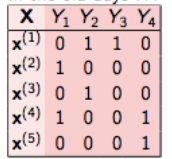
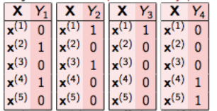
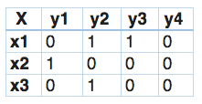
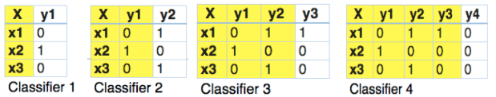
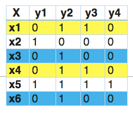
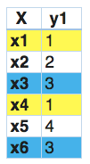

# 多标签分类问题
有多个类别，但每个样例可能对应多个类别，因此这些问题被称为多类分类问题。
通过一份体检报告判断一个人是否患有以下五种病：有序排列——`[高血压，高血糖，肥胖，肺结核，冠心病]`，一个样本`[1,0,1,0,0]` ，其中1代表该位置的患病，0代表没患病。所以这个label的含义：患者有高血压和肥胖。

## 解决多标签分类问题的方法：
基本上，有三种方法来解决一个多标签分类问题，即:
1. 问题转换
2. 改编算法
3. 集成方法

### 问题转换：
在这个方法中，我们将尝试把多标签问题转换为单标签问题。这种方法可以用三种不同的方式进行:
二元关联（Binary Relevance）
分类器链（Classifier Chains）
标签Powerset（Label Powerset）

二元关联（Binary Relevance）
这是最简单的技术，它基本上把每个标签当作单独的一个类分类问题。例如，让我们考虑如下所示的一个案例。我们有这样的数据集，X是独立的特征，Y是目标变量。

在二元关联中，这个问题被分解成4个不同的类分类问题，如下图所示。

### 分类器链（Classifier Chains）
在这种情况下，第一个分类器只在输入数据上进行训练，然后每个分类器都在输入空间和链上的所有之前的分类器上进行训练。
让我们试着通过一个例子来理解这个问题。在下面给出的数据集里，我们将X作为输入空间，而Y作为标签。

在分类器链中，这个问题将被转换成4个不同的标签问题，就像下面所示。黄色部分是输入空间，白色部分代表目标变量。这与二元关联非常相似，唯一的区别在于它是为了保持标签相关性而形成的。

### 标签Powerset（Label Powerset）
在这方面，我们将问题转化为一个多类问题，一个多类分类器在训练数据中发现的所有唯一的标签组合上被训练。让我们通过一个例子来理解它。

在这一点上，我们发现x1和x4有相同的标签。同样的，x3和x6有相同的标签。因此，标签powerset将这个问题转换为一个单一的多类问题，如下所示。

因此，标签powerset给训练集中的每一个可能的标签组合提供了一个独特的类。

## 深度学习方法：
### 模型输入输出
假设我们有一个体检疾病判断任务：通过一份体检报告判断一个人是否患有以下五种病：有序排列——[高血压，高血糖，肥胖，肺结核，冠心病]
输入：一份体检报告
输出：`[1,0,1,0,0 ]` ，其中1代表该位置的患病，0代表没患病。所以这个`label`的含义：患者有高血压和肥胖。
### 模型架构
接下来如何建立模型呢:
当然可以对`label`的每一个维度分别进行建模，训练5个二分类器。
但是这样不仅是的`label`之间的依赖关系被破坏，而且还耗时耗力。

接下来我们还是来看看深度神经网络是如何应用于此问题的。其架构如下：
采用神经网络做特征提取器，这部分不需要多解释，就是一个深度学习网络；
采用`sigmoid`做输出层的激活函数，若做体检疾病判断任务的话输出层是5个节点对应一个5维向量，这里没有采用`softmax`，就是希望`sigmoid`对每一个节点的值做一次激活，从而输出每个节点分别是 1 概率；

采用`binary_crossentropy`损失函数函数，这样使得模型在训练过程中不断降低`output`和`label`之间的交叉熵。其实就相当于模型使`label`为1的节点的输出值更靠近1，`label`为0的节点的输出值更靠近0。

有点类似 Structure Learing ，最终模型的输出就是一个结构序列。
