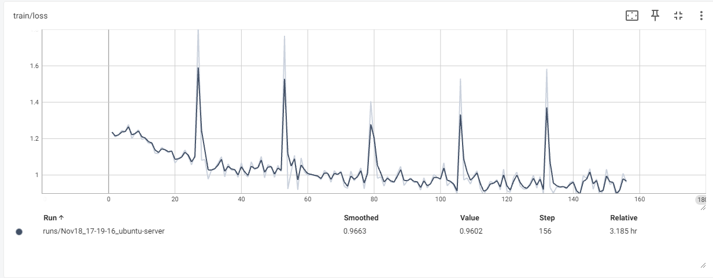
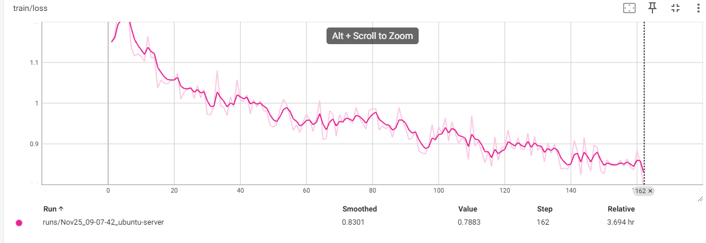

# 大模型下游任务微调时loss出现尖刺处理办法  

之前在对大模型进行微调时，loss出现了尖刺，现在想起来就记录一下。  
先说一下下游任务，模型的输入是较长的文本（单个样本约`4000 tokens`，`7000`左右的文本长度），输出是特定格式的文本摘要。  

训练主要硬件配置如下：
```bash
CPU：Intel(R) Xeon(R) Gold 5318Y CPU @ 2.10GHz
GPU： 2 * 4090 24G
内存：128 GB
```
基座模型及训练的主要参数如下：
```bash
base model：Qwen2.5-7B-Instruct-GPTQ-Int8
total batch size: 32
lr: 1e-6
num_train_epochs: 5
lora_rank: 8
lora_alpha：16
lr_scheduler_type：cosine_with_restarts
lr_scheduler_num_cycles：4
```  

训练方式：用`accelerate`的分布式后端`FSDP`做数据并行`DDP`，训练代码是二次封装的`transformers`的`Trainer`，数据处理部分是自己写的，对输入的`system`、`user`部分的`token`做了屏蔽，只计算模型回复部分`assistant`部分的`loss`。然后出现了让广大LLMer头疼的问题：loss尖刺。如下图所示。  

  

除了第0个`epoch`，每个`epoch`的第一个`batch`都出现`loss`尖刺，尝试跳过每个`epoch`的第一个`batch`、重新打乱数据，问题依然存在。也试过打印第一个`batch`的数据进行检查，但并没有发现异常。  

后面在网上搜到了这篇博客：[Hugging Face Accelerate 两个后端的故事：FSDP 与 DeepSpeed](https://huggingface.co/blog/zh/deepspeed-to-fsdp-and-back) 。省流： `FSDP` 与 `DeepSpeed` 在混合精度处理方面有差异，`FSDP`使用较低的学习率可能会导致不收敛。另外考虑到动态学习率的循环次数`num_cycles`和`num_train_epochs`较接近，可能会对`loss`有影响。故对调整以下参数为新的值：  

```bash
lr: 1e-4
lr_scheduler_num_cycles：8
```  
问题解决：  
  