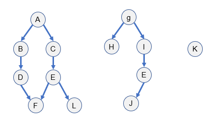
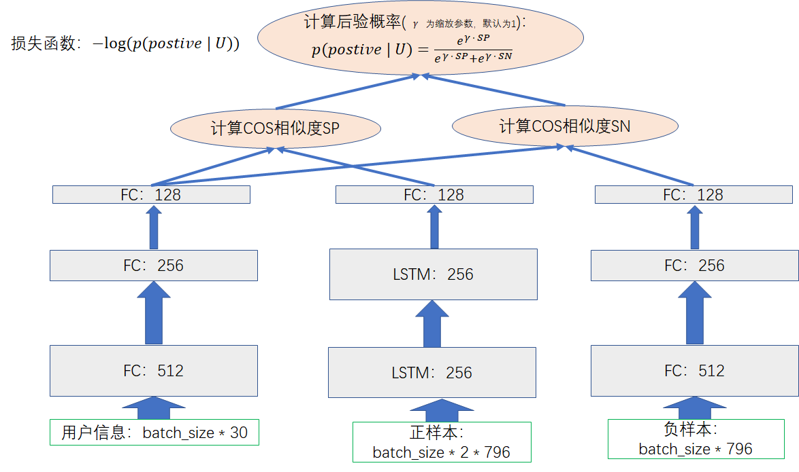
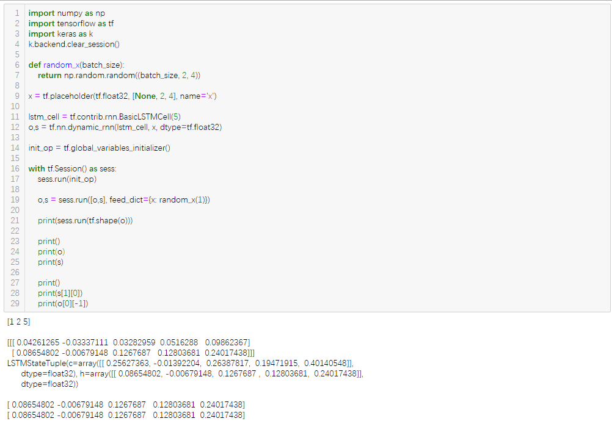
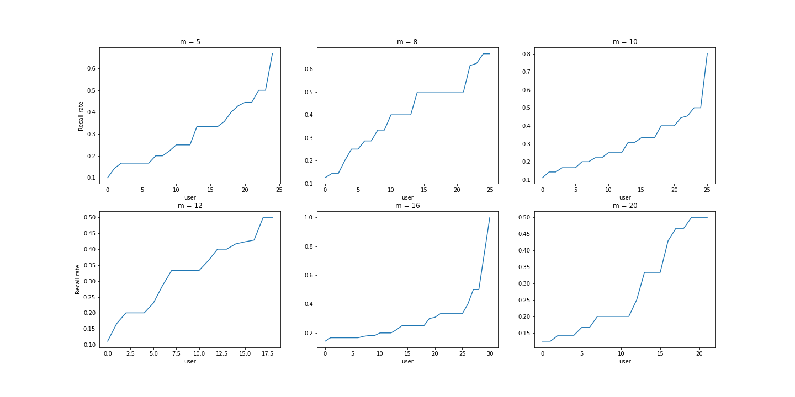
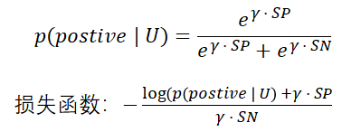

``` python
#对于一些简单的for循环用map和lambda优化，加快脚本运行速度， 如
lines = list(map(lambda x : list(eval(x)), lines))
#对于一些经常要判定一个元素是否在某个数组里面的操作，将数组转换为集合，加快查找速度
set(map(lambda x : x[0], n_movies))
```

### 数据处理部分
1. 电影间的依赖关系：使用networkx随机生成有向无环图，共生成10个有向无环图，根据生成的图可以生成业务矩阵：
```text
矩阵的列：vertex, next_job, negative_job, clicked_job, parents
一个顶点的next_job生成：
    1)取该顶点v的孩子顶点，记为v_children
    2)取该顶点v所有父顶点中孩子顶点，但这些孩子顶点不是v的父顶点,记为v_p_c
    3)v_children和v_p_c取并集，该并集即是next_job
    
一个顶点的negative_job生成：
    1)取该顶点v所在连通子图的所有顶点v_connect
    2)在v_connect中删除该顶点v本身，删除v的所有孩子顶点，删除v的所有父顶点以及父顶点的孩子顶点，剩余的顶点记为v_res
    3)将v_res和其它连通子图（即所有非顶点v所属的连通子图）的所有顶点取并集，该并集即是negative_job
    
clicked_job=parents
```
 

### 数据处理过程
1. 电影选取：统计数据集中每部电影被用户交互过的次数，从大到小排序，从交互比较稠密的前200个电影中随机抽取152部。
根据选取出的152部电影选出交互过这些电影是用户，如果用户交互过的所有电影的负样本的交集为空，则不选择该用户；并且，每个用户交互过的电影必须大于4个，防止用户交互信息过于稀疏。
2. 生成用户行为数据：根据选出的用户和其交互过的电影信息，生成[用户id，业务id，评分，上一次交互id，时间戳] 格式的行为数据，上一层交互id不存在用-1代替，业务id即是152个电影id。
3. 将选出的电影特征做处理，将电影上映年份、种类处理为one hot向量。
将用户信息的邮政编码归一化处理，将用户的性别、职业、年龄等信息处理为 one hot 向量。
4. 将电影标题使用bert_as_service生成1x768的句子向量，给定一个在一定单词数在一定范围内的句子，bert as service能生成该句子的1x768的向量。
5. 编写DataInput类，用于将行为数据中的用户id和用户信息（职业性别等向量）、电影id和电影信息（电影类型、发行年份的one hot向量，bert句子向量等）关联起来，生成一条样本数据。编写next_batc()方法用于生产下一批次的样本数据，作为模型的输入，next_batc()函数用参数isTrain来判断当前的next batch是训练数据还是测试数据。

#### 模型部分
模型如图所示

1. 在忽略batch size的情况下，用户信息的输入tensor为 1x30；正样本的输入tensor为 2 * 796，2是lstm cell输入的max time，即是有2个时间序列，表示电影依赖关系a->b的序列，796中的768是电影标题的句子向量，剩下的28是电影种类、发行年份的one hot 向量；负样本的输入仅仅是一个电影的信息向量，1x796。
2. 封装tensorflow的全连接层函数：
    ```python
    def add_dense(input_tensor, output_size, layer_name, keep_prob=1.0, activation_function=None, reuse=False):
        '''添加一个全连接层。
        输入的tensor，输出的维度，层的名字
        '''
        #获得tensor的列数（shape的第二个维度）
        input_cloumn = input_tensor.get_shape()[1]
        
        #计算dropout_rate
        # dropout_rate = 1.0 - keep_prob
        
        with tf.variable_scope('dense_layer_' + layer_name, reuse=reuse):
            weights = tf.get_variable('weights', [input_cloumn, output_size], initializer=tf.truncated_normal_initializer(stddev=0.1))
            biases = tf.get_variable('biases', [output_size], initializer=tf.constant_initializer(0.0001))
            
            variable_summaries(weights, layer_name + '_weights')
            variable_summaries(biases, layer_name + '_biases')
            mul_op = tf.matmul(input_tensor, weights) + biases

            output_tensor = None
            if activation_function == None:
                output_tensor = mul_op
            else:
                output_tensor = activation_function(mul_op)

            if keep_prob != 1.0:
                output_tensor = tf.nn.dropout(output_tensor, keep_prob=keep_prob)

            return  output_tensor
    ```
3. 封装tensorflow的LSTM层函数：
    ```python
    def add_LSTM(input_tensor, num_units_per_layer_list, layer_name, keep_prob=1.0, reuse=False):
    '''添加一个长短期记忆网络。
    input_tensor：输入tensor，[batch_size, max_time, cell.output_size]
    num_units_per_layer_list：LSTM的隐藏单元个数列表
    '''

    # drop_rate = 1.0 - keep_prob

    with tf.variable_scope('lstm_layer_' + layer_name, reuse=reuse):

        lstm_layers = []

        for size in num_units_per_layer_list:
            lstm_cell = tf.contrib.rnn.BasicLSTMCell(size)

            if keep_prob != 1.0:
                lstm_cell = tf.contrib.rnn.DropoutWrapper(lstm_cell, output_keep_prob=keep_prob)

            lstm_layers.append(lstm_cell)

        if len(lstm_layers) > 1:
            muti_Lstm_cells = tf.contrib.rnn.MultiRNNCell(lstm_layers)
            # init_state = muti_Lstm_cells.zero_state(batch_size, dtype=tf.float32)
            _, final_state = tf.nn.dynamic_rnn(cell=muti_Lstm_cells, inputs=input_tensor, dtype=tf.float32)
            
            # 'outputs' is a tensor of shape [batch_size, max_time, sequence_length]
            # 'state' is a N-tuple where N is the number of LSTMCells containing a tf.nn.rnn_cell.LSTMStateTuple for each cell
            output = final_state[-1][1]
        else:
            _, final_state = tf.nn.dynamic_rnn(lstm_layers[0], input_tensor, dtype=tf.float32)
            output = final_state[1]
    
    return output
    ```
4. 计算余弦相似度：
   ```python
   with tf.name_scope('calu_cos_similarity'):
    #user_item和postive_item的相似度

    #||user_norm|| = sqrt(sum(each ^ 2))
    user_norm = tf.sqrt(tf.reduce_sum(tf.square(user_dense_output), axis=1, keep_dims=True))

    #||pos_norm|| = sqrt(sum(each ^ 2))
    pos_norm = tf.sqrt(tf.reduce_sum(tf.square(pos_dense_output), axis=1, keep_dims=True))
    #  user_dense_output * pos_dense_output
    user_pos = tf.reduce_sum(tf.multiply(user_dense_output, pos_dense_output), axis=1, keep_dims=True)
    #||user_norm|| * ||pos_norm||，作为相似度的分母 
    user_pos_norm_prod = tf.multiply(user_norm, pos_norm)
    #用户item输出和正样本输出的相似度R(user, pos)，R_user_pos = (user_dense_output * pos_dense_output) / ||user_norm|| * ||pos_norm||
    R_user_pos = tf.truediv(user_pos, user_pos_norm_prod)

    #||neg_norm|| = sqrt(sum(each ^ 2))
    neg_norm = tf.sqrt(tf.reduce_sum(tf.square(neg_dense_output), axis=1, keep_dims=True))
    #user_neg = user_dense_output * neg_dense_output
    user_neg = tf.reduce_sum(tf.multiply(user_dense_output, neg_dense_output), axis=1, keep_dims=True)
    #||user_norm|| * ||neg_norm||
    user_neg_norm_prod = tf.multiply(user_norm, neg_norm)
    #用户item输出和负样本输出的相似度R(user, neg)，R_user_neg = (user_dense_output * neg_dense_output) / ||user_norm|| * ||neg_norm||
    R_user_neg = tf.truediv(user_neg, user_neg_norm_prod)
   ```
5. 计算后验概率：
    ```python
    with tf.name_scope('calc_posterior_probability'):
    #exp(gamma * R(User, item))
    GAMMA = 1.0

    exp_R_user_pos = tf.exp(tf.multiply(GAMMA, R_user_pos))
    exp_R_user_neg = tf.exp(tf.multiply(GAMMA, R_user_neg))

    #sum_exp_R = exp(gamma * R_user_pos) + exp(gamma * R_user_neg)
    sum_exp_R = tf.add(exp_R_user_pos, exp_R_user_neg)

    #p(pos | user) = exp_R_user_pos / sum_exp_R
    prob_pos_user = tf.truediv(exp_R_user_pos, sum_exp_R)

    #p(neg | user) = exp_R_user_neg / sum_exp_R
    # prob_neg_user = tf.truediv(exp_R_user_neg, sum_exp_R)

    ```
6. 损失函数
   ```python
   with tf.name_scope('loss_function'):

    # loss = -log(p(item_1 | user) * ... * p(item_n | user)),约束条件:item_i 属于被激活的item
    log_prob_pos_user = tf.log(tf.clip_by_value(prob_pos_user, 1e-6, 1.0))
    # log_prob_neg_user = tf.log(tf.clip_by_value(prob_neg_user, 1e-6, 1.0))

    # loss = -tf.reduce_sum(tf.add(log_prob_pos_user, log_prob_neg_user))
    loss = -tf.reduce_sum(log_prob_pos_user)    
    # tf.summary.scalar('loss', loss)
   ```

7. 训练模型：训练得到的loss要除以batch size，以得到每个输入样本的loss。
8. 关于tensorflow中LSTM输出：返回的`final_states`是个二元组(LSTMCell的参数`state_is_tuple=Tru`e时才返回二元组，默认为true)，state[0]是cell state，final_states[1]是hidden state，可以取`hidden state`作为lstm的输出（即`output = final_states[1]`），对于多层lstm网络，取最后一个时间序列的final_state作为输出，即是`output = final_states[-1][1]`。返回的outputs是记录的每一次的时间序列的输出，对于某些问题（如翻译），需要得到每次时间序列的lstm输出。对于LSTM后还接一个全连接层的模型，可以取所有时间序列的output作为全连接层的输入，`output = tf.reshape(outputs`,` [-1,lstm_unit]`)，`lstm_unit`为LSTM的隐藏神经单元个数。一般地，`batch size = 1`时，`final_states.shape = (1, lstm_unit)`，`outputs.shape = (1, max_time, lstm_unit)`，`final_states[1][0] = outputs[0][-1]`，即是`final_state`记录了每一条样本输出outputs的最后一次时间序列的输出。


9. 计算召回率：模型训练好之后，使用测试数据集计算召回率。
    a. 每次取一个用户（该用户必须在训练集和测试都有行为数据），给定一个估计集中最少推荐电影个数m。
    b. 根据用户在训练集中交互过的电影中找出候选顶点，候选顶点：对用户在训练集中交互过的所有电影，找出每个电影顶点的孩子顶点（仅获取一层）、兄弟顶点和所有父顶点的孩子顶点（不包括父顶点本身），最后取并集，得到候选顶点，如若候选顶点不足m个，则从所有顶点中随机取若干个顶点补足m个，这m个电影顶点作为模型的正样本输入。
    c. 根据训练好的模型计算用户信息和正样本的cos相似度SP，根据相似度SP从大到小排序，取前top k个顶点集，这k个顶点集和该用户的测试集中电影顶点集test_set取交集，记交集为i_set.
    d. 该用户的召回率 = len(i_set) / len(test_set)。最后求所有用户的平均召回率（图中仅仅展示求得的召回率，并没有算出评价召回率）。



10. 模型改进：损失函数加入约束项，防止用户信息与正样本的相似度、用户信息与负样本的相似度过快收敛。

