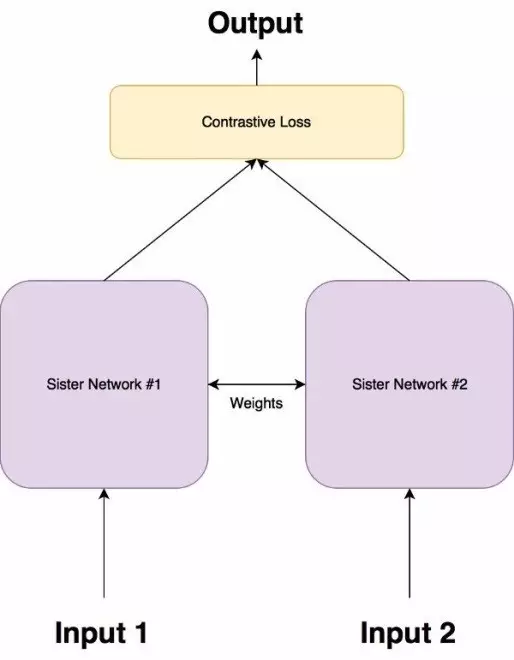
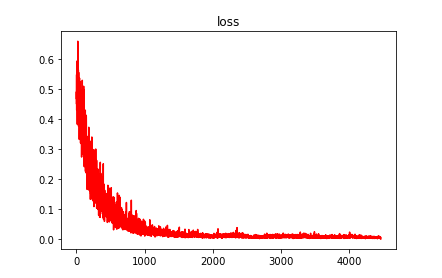
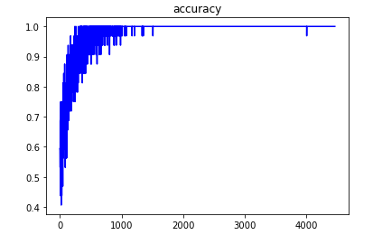
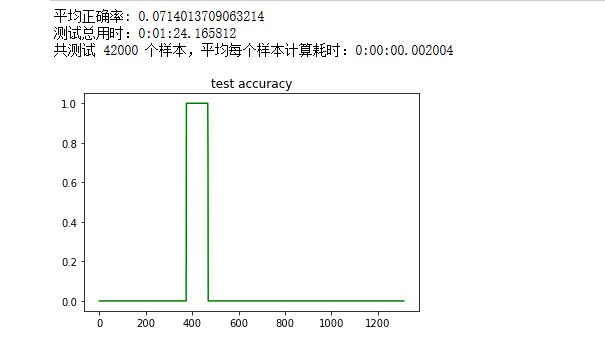

#### 孪生网络之小样本学习：
1. DL标准分类方法：输入x通过多层神经网络后，输出x属于某一类（或多个类）的概率。
2. 小样本分类方法：每个类只需要为数不多的训练样本，要求要识别的样本与训练样本相似，如人脸识别。
   
#### 孪生网络
孪生网络和学习输入的特征进行分类的网络不同，孪生网络在两个输入中进行区分，即是学习两个输入的相似度。

孪生网络由两个完全相同的神经网络组成，每个都采用两个输入图像中的一个。然后将两个网络的最后一层馈送到对比损失函数，用来计算两个图像之间的相似度。它具有两个姐妹网络，它们是具有完全相同权重的相同神经网络。图像对中的每个图像将被馈送到这些网络中的一个。使用对比损失函数优化网络（我们将获得确切的函数）



#### 损失函数：
使用和普通神经网络所不同的损失函数：对比损失函数（Contrastive Loss Function）
孪生架构的目的不是对输入特征进行分类，而是区分它们。因此，分类损失函数（如交叉熵）不是最合适的选择。相反，这种架构更适合使用对比函数。一般而言，这个函数只是评估网络区分一对给定的图像的效果如何。
$$
    L = \frac{1} {2N} \sum_{i=1}^{n} yd^2 + (1-y)max(margin-d, 0)^2
$$

其中$d=||an−bn||_2$，代表两个样本特征的欧氏距离，y为两个样本是否匹配的标签，`y=1`代表两个样本相似或者匹配，`y=0`则代表不匹配，`margin`为设定的阈值。
欧氏距离`d`：
$$
    d=\sqrt{(G_w(x_1) - G_w(x_2))^2}
$$
其中$G_w$是其中一个姐妹网络的输出。$X1$和$X2$是输入数据对。
说明：
Y值为1或0。如果模型预测输入是相似的，那么Y的值为0，否则Y为1。
max（）是表示0和m-Dw之间较大值的函数。
m是大于0的边际价值（margin value）。有一个边际价值表示超出该边际价值的不同对不会造成损失。这是有道理的，因为你只希望基于实际不相似对来优化网络，但网络认为是相当相似的。


#### 处理多分类、少样本的问题：
训练数据要保证基本正、负样本比例接近1:1
数据集划分：训练集，测试集，支持集（Support Set），其中支持集包含所有类的样本

#### 训练：
x1、x2可以是正样本、负样本
   1. 样本x1通过网络得到输出y1
   2. 样本x2通过网络得到输出y2
   3. 使用y1、y2计算对比损失
   4. 反向传播计算梯度
   5. 使用优化器更新权重
   6. 训练集中，x1、x2和标签y的对应关系 

x1和x2的关系|y|
---|:--:|
x1、x2属于同一类|0|
x1、x2属于不同类|1|

#### 测试：
给定测试样本 x ，从支持集中依次取出每个类 x_i（ i=1,2,3,....n ），x 和所有 x_i 依次通过孪生网络，若 x_j 和 x 的相似度最高，则认为 x 属于第 j 类（即 x_j 所属的类）


#### 实验：
##### 数据：
新闻标题数据集，14个类。小样本：每个类中随机抽取50条数据做为训练数据。 

训练集：每个类的50条样本和自身做笛卡尔乘积，得到 50 x 50 = 2500 条正样本，即这2500条样本（x1,x2）对应的y=1；负样本：对每一类，从其余类的各50个样本中，每个类随机抽取 50 / 14 = 4个样本，共56个样本，和该类的50个样本做笛卡尔积组成 50 x 56 = 2800个负样本，即是(x1, x2)对应的 y=0，x1为该类样本，x2为其他类样本。共71400条训练数据
测试集：每个类随机选取3000条，共42000条数据。 

支持集：支持集的选定较为困难。孪生网络在人脸识别中取得的效果非常好，网络训练好之后，直接拿一张人脸照片就可以作为支持集，支持集的样本和测试集的样本输入孪生网络后，网络会输出这两个样本的相似度，再根据相似度判断测试样本和支持样本是否属于同一个类。具体支持集的选取会在实验部分讨论。

#### 字向量：
使用开源的基于人民日报语料、Word + Ngram训练的预训练词向量，包含1664K的字、词。每个字、词的维度是300。向量矩阵大小：972M

#### 模型：
```python
SiameseClassifier(
  Conv1D(filters=128, kernel_size=4, strides=2, activation='relu')
  Conv1D(filters=64, kernel_size=3, strides=2, activation='relu')
  Dense(64, activation='relu')
  Dense(32, activation='relu')
  Dense(16, activation='sigmoid')
)
```
模型最后输出一个长度为16的一维数组，用于计算相似度。

#### 损失函数：
使用对比损失函数，描述两个输出向量之间的欧氏距离的损失。
```python
#对比损失函数
class ContrastiveLoss(tf.keras.losses.Loss):
    def __init__(self, margin=2.0):
        '''
        margin为边界值
        '''
        super().__init__()
        self.margin = margin
        
    def call(self, y_true, y_pred):
        '''
        output1和output2为二维数组:(batch_size, dim)
        '''
        output1 = y_pred[0]
        output2 = y_pred[1]
        label = tf.cast(y_true,dtype=tf.float32)
        
        #计算欧氏距离 d = sqrt(sum(pow((x - y), 2))
        d_eu = tf.sqrt(tf.reduce_sum(tf.square(output1 - output2), 
                        axis=1,keepdims=False))
        
        #计算对比损失：
        #loss= Y * (Dw)^2 / 2 + (1 - Y) * max((0, margin - Dw))^2 / 2
        #其中，Dw为模型输出之间的欧氏距离，Y为标签，0或1，margin为边界值
        loss = (label * tf.square(d_eu) + (1.0 - label) * 
                tf.square(tf.maximum(self.margin - d_eu, 0.0))) / 2
                 
        #返回的loss会被自动reduce_mean
        return loss
```
#### 正确率的计算：
损失函数中使用欧氏距离来刻画两个向量之间的相似程度，欧氏距离的值域范围是[0,+∞]，并不适合设置一个阀值来衡量相似或者不相似。解决方法是将欧氏距离映射到[0, 1]的区间（归一化），和余弦相似度的值域一样，接近1就越相似，接近0就越不相似。
```python
def euclidean_distance(x1, x2, keepdims=False):
    '''
    计算两个tensor的欧氏距离
    '''
    return tf.sqrt(tf.reduce_sum(tf.square(x1 - x2), 
                    axis=1,keepdims=keepdims))

def euclidean_similarity(x1, x2):
    '''
    将两个tensor之间的欧氏距离转化为相似度，主要是一个归一化的操作
    '''
    d = euclidean_distance(x1, x2)
    s = 1.0 / (1.0 + d)
    
    return s
```
在计算正确率的时候，将测试样本x1，支持集样本x2（n个类就有n个x2）依次通过孪生网络，得到n个一维相似度数组，最后做argmax运算即可得出x1是属于n个类中的第几个类。
```python
with tf.device('/gpu:0'):
        for x,y in test_iterator:
            class_probability = []
           
            y1 = model.call_once(x)
            
            for i in range(support_n):
                x2 = support_vector[i]
                #对y2进行batch_size复制
                x2 = np.expand_dims(x2,axis=0)
                x2 = a= np.repeat(x2, x.shape[0], axis=0)
                
                y2 = model.call_once(x2)
                
                #计算相似度
                s = euclidean_similarity(y1,y2) #shape: (batch_size,)
                class_probability.append(s)
                
#             print(np.array(class_probability).shape)
            
            y_pred = tf.argmax(class_probability, 
                                axis=0).numpy().astype(np.int32)

            test_acc = np.sum(y_pred == y) / y.shape[0]
```
#### 训练：
机器配置：CPU：i5-8300H；显卡：1050TI；内存：16G；显存：4G
```bash
BATCH_SIZE = 32
EPOCH = 2
LEARNING_RATE = 0.001
```
1. 使用Adam优化器。
训练时，让输入x1和x2分别通过模型，得到两个输出y1和y2，再用y1和y2计算损失和正确率。
训练损失：

训练正确率：


#### 测试：
每个类的训练样本只有50个，训练时候正确率已经接近100%（过拟合问题后面讨论）。但是测试集的正确率训练的过程中的正确率相差甚远。
（支持集的作用是当一个类示例，看测试样本和示例样本是否相似）
将训练数据（14个类 x 每个类50条样本）求和作为支持集：
平均正确率只有7%，出现了某一批次的测试数据正确率达100%，其余测试数据正确率为0，原因未知。


### 原因分析：
本实验每个类别使用50个样本，满足小样本的特性，但是模型训练完成之后，用测试集测试模型，正确率不到40%。孪生网络应用在人脸识别模型较多（即是输入两张人脸，看这两张人脸是不是属于同一个人），训练一个模型只需要少量样本。人脸图像的特征较为明显（有鼻子、有眼睛等），图像特征也相对容易捕捉。但是当将孪生网络用于少样本的文本分类任务后，一个类别的文本表述方式千变万化，很难通过少量样本找到该类文本的明显特征。
比如，对于财经类的文本：“铜价上涨趋势不变 短期震荡后进一步上扬”出现在了训练集当中，假设这个样本也是财经类的支持集样本，当测试集遇到“午评：期市全线反弹 有色金属郑糖领涨”，出现了“铜”、“有色金属”的特征，则孪生网络可以认为属于同一个类别；但是当测试集样本“保命比业绩更重要 基金上演熊市年底冲刺”，当“基金”、“熊市”等特征没有出现在训练集时，孪生网络则不能正确地划分该类。

综上所述，孪生网络用于多类别文本分类不可行。

