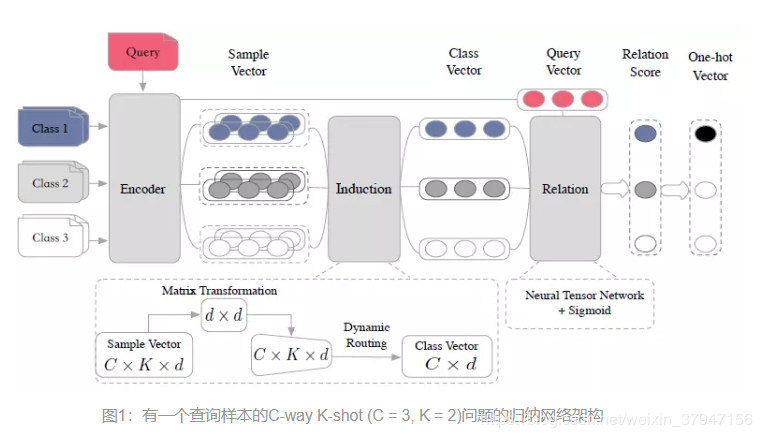
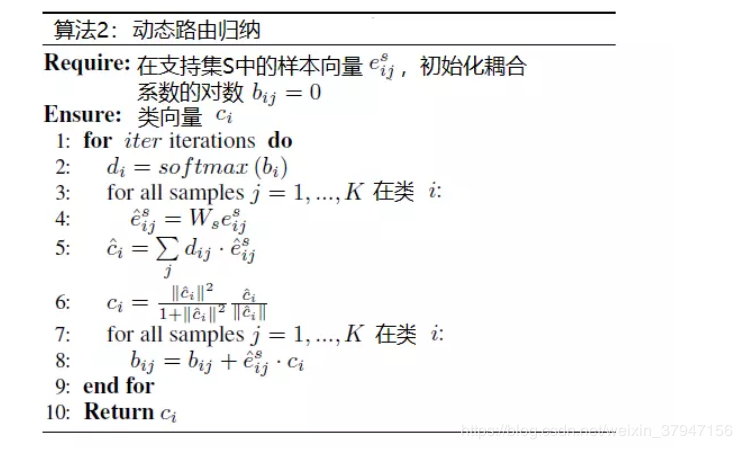

# 孪生网络（Siamese Network）
本质上还是一个网络，但是每次都是两个样本输入到网络中，再计算网络两个输出的相似度。数据集划分为：训练集，支持集，测试集。训练集：从同一类别下采样相同的两个句子作为正样本，从不同的类别下采样两个句子作为负样本，保证正负样本对的数量接近1：1，然后输入到孪生网络中作为一个二分类的任务来度量两个句子之间的距离。

# Induction Network（感应网络）
训练集中，每一个episode的时候，都随机选择C个类（训练集中的类别个数大于C），然后每一个类别都同样随机选择K个样本，这样每一个episode中的数据样本个数便是C * K个，这CK个样本组成support set S，此外，再从剩余的样本中随机选择n个样本作为query set Q，每一个episode都在这样选择出来的S和Q上进行训练
网络由三个模块组成：编码器模块，归纳模块和关系模块

## 编码器模块：
相当于一个encoder。可以利用CNN，LSTM和Transformer等等，在阿里的论文《Few-Shot Text Classification with Induction Network》中论使用LSTM，简单讲就是：针对每一个样本，将LSTM各个时刻的隐层输出h，做一次self-attention，最后得到一个向量e。
## 归纳模块：
借用了胶囊网络的动态路由概念，将每一个类别中的样本表征，最后转化凝练成为class-level的表征。

## 关系模块：
在归纳模块生成类向量C^i并且查询集中的每个查询文本被编码器模块编码为查询向量e^q之后，下一步就是计算每对查询向量和类向量之间的相关性，输出区间在[0,1]之间的得分

# 原型网络（Prototypical Network） 
论文《Prototypical Networks for Few-shot Learning》
给定一个训练时的train set，测试时的support set和query。support set 包含C个类别，每个类别下含有K个样本。train set 包含M个类别，每个类别下含有N个样本。为了在训练时期模拟测试时的场景，我们在训练时构造一系列的episode，每个episode实际上就是一个meta task。那该怎么构造这样一个episode呢？从train set中随机抽取C个类别，然后从每个类别中随机抽取K个样本，构造训练时期的support set，这样的问题也称为C-way K-shot问题，接着从另外N-K个样本中选取n个样本作为训练时期的query。构造一系列这样的episode来训练网络

# 关系网络（Relation Network）
论文《Learning to Compare: Relation Network for Few-Shot Learning》
整个训练和预测时的方法和原型网络是一样的。其主要创新点在于之前的网络都会给定一个确定的距离度量函数，然而作者认为没有一个确定的距离函数能作为所有类别的最佳度量函数，因此作者让网络自己去学习一个这样的度量函数，这里的Relation network就是通过关系网络来度量query和各类别之间的关系
