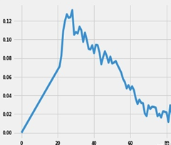
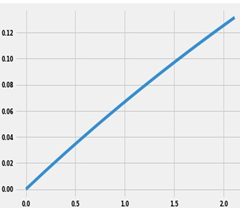

## 前言
&emsp;&emsp;IV值（Information Value），信息价值指标，是评价一个特征好不好的指标之一。在金融风控领域广泛应用，尤其是在特征选择的场景下，会经常使用这个指标，特征选择得好不好，将直接影响模型的效果。  

&emsp;&emsp;在金融风控领域，我们处理的更多是二分类问题，即是判断一个账号黑账户还是白账户。风险识别模型的效果很大程度上取决于对黑账户特征的分析，分析的黑账户越多，特征经验越丰富，模型效果越好。但是如何挑选分析得到的特征呢？用什么样的标准去判断这个特征能不能用呢？最方便的方法当然是拿所有的特征去训练一个模型，看看特征重要性，但这不是本文讨论的内容，我们要在特征做完之后，立刻判断这个特征能不能用，而不是等所有特征做完再去看特征重要性。用IV值！  

## IV值先验知识1：分箱
&emsp;&emsp;特征分箱主要是为了降低变量的复杂性和减少变量噪音对模型的影响，提高自变量和因变量的相关度，从而使模型更加稳定。  

&emsp;&emsp;监督学习中的分箱常用的有Split分箱和Merge分箱。
- Split 分箱是一段连续的值分为若干段离散的值，Split分箱和决策树比较相似，切分点的选择指标主要有信息熵、gini 指数等。比如，年龄可以分为 ≤18，19-24，25-35，35-54，≥55。
- Merge分箱则通过计算两个从小到大排序的数值的卡方值，将最小卡方值的相邻组合并为一组，再重新排序，重新计算卡方值，合并组，直到计算出的卡方值都不低于事先设定的阈值, 或者分组数达到一定的数量。  

## IV值先验知识2：WOE编码
&emsp;&emsp;分箱之后我们便得到了一系列的离散变量，接下来需要对变量进行编码，将离散变量转化为连续变量。WOE编码是评分卡模型常用的编码方式。  
&emsp;&emsp;WOE称为证据权重(weight of evidence)，是一种有监督的编码方式，将预测类别的集中度的属性作为编码的数值。对于自变量第 $i$ 箱的WOE值为：
$$
    WOE_i = ln(\frac{P_{i_1}} {P_{i_0}} ) = ln(\frac {B_i / B_T} {
        G_i / G_T
    })
$$
&emsp;&emsp;其中:  
&emsp;&emsp;$P_{i_1}$ 是第 $i$ 箱中黑账户占所有黑账户比例；  
&emsp;&emsp;$P_{i_0}$ 是第 $i$ 箱中白账户占所有白账户的比例；  
&emsp;&emsp;$B_i$ 是第 $i$ 箱中黑账户的个数；  
&emsp;&emsp;$G_i$ 是第 $i$ 箱中白账户的个数；  
&emsp;&emsp;$B_T$ 是所有黑账户个数；  
&emsp;&emsp;$G_T$ 是所有白账户个数。  

&emsp;&emsp; 变换以后可以看出，WOE也可以理解为当前分箱中黑账户和白账户的比值，和所有样本中这个比值的差异。WOE越大，这种差异越大，当前分组里的黑账户的可能性就越大，WOE越小，差异越小，这个分组里的样本响应的可能性就越小。当分箱中黑账户和白账户的比例等于样本中所有黑账户和白账户的比值时，说明这个分箱没有预测能力，即WOE=0。  

### QA：为什么不直接使用原始数据中的连续变量，而是先分箱为离散变量，再将离散变量转换为连续变量WOE编码？
>&emsp;&emsp;WOE可以把相对于预测变量显现非线性的特征转换为线性。例如：很多黑账户的年龄在19-24岁，随着年龄的增长黑账户逐渐变小，黑账户数量（纵坐标，数值为黑账户占总账户比）和年龄是一个非线性的关系。分箱后转换为WOE编码，黑账户数量（纵坐标，数值为黑账户占总账户比）和WOE值呈线性关系。如下图所示，对于机器学习模型而言，线性关系更容易区分黑白账户。

  

## IV值计算
&emsp;&emsp;特征变量中第 $i$ 个分箱对应的IV值的计算公式为：
$$
    IV_i = ( \frac{B_i} {B_T} - \frac{G_i} {G_T} ) \times ln(\frac {B_i / B_T} {
        G_i / G_T})   \\
    = ( \frac{B_i} {B_T} - \frac{G_i} {G_T} ) \times  WOE_i
$$

&emsp;&emsp;变量中第 $i$ 个分箱对应的IV值的计算公式为：
$$
    IV = \sum \limits _{i = 1}^n IV_i
$$

特别地，如果特征没有进行分箱操作，相当于只有一个像，上面公式的i和i都等于1。
IV值的取值范围是[0,+∞)，当分箱中只包含白账户或只包含黑账户时，IV = +∞，当分箱中黑白账户比例等于整体黑白账户比例时，IV为0。

IV值计算完成后，即可根据IV值的大小判断特征是否对有用（特征的预测能力是否强）。

IV值范围|预测能力
---|:--:
＜0.02 | 无效特征，无预测能力
[0.02, 0.10) | 弱效果特征，预测能力弱
[0.10, 0.50) | 有效特征，预测能力中等
≥0.50 | 强特征，预测能力强