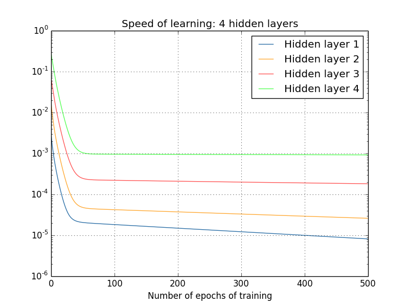

## 梯度消失 

&emsp;&emsp;梯度消失是指通过隐藏层从后向前看，梯度会变的越来越小，说明前面层的学习会显著慢于后面层的学习，所以学习会卡住，除非梯度变大。
通俗来讲就是多个小于1的参数多次连乘，导致结果非常小。如图中蓝色线条所示。

&emsp;&emsp;梯度消失的原因受到多种因素影响，例如学习率的大小，网络参数的初始化，激活函数的边缘效应等。在深层神经网络中，每一个神经元计算得到的梯度都会传递给前一层，较浅层的神经元接收到的梯度受到之前所有层梯度的影响。如果计算得到的梯度值非常小，随着层数增多，求出的梯度更新信息将会以指数形式衰减，就会发生梯度消失。下图是不同隐含层的学习速率。

  

## 梯度爆炸
&emsp;&emsp;在深度网络或循环神经网络（Recurrent Neural Network, RNN）等网络结构中，梯度可在网络更新的过程中不断累积，变成非常大的梯度，导致网络权重值的大幅更新，使得网络不稳定；在极端情况下，权重值甚至会溢出，变为NaN值，再也无法更新。
通俗来讲就是多个大于1的参数多次连乘，导致结果非常大。

