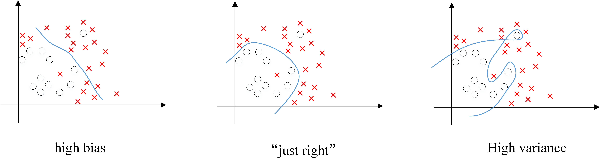

# 为什么要正则化？

深度学习可能存在过拟合问题——高方差，有两个解决方法，一个是正则化，另一个是准备更多的数据，这是非常可靠的方法，但你可能无法时时刻刻准备足够多的训练数据或者获取更多数据的成本很高，但正则化通常有助于避免过拟合或减少你的网络误差。
如果你怀疑神经网络过度拟合了数据，即存在高方差问题，那么最先想到的方法可能是正则化，另一个解决高方差的方法就是准备更多数据，这也是非常可靠的办法，但你可能无法时时准备足够多的训练数据，或者，获取更多数据的成本很高，但正则化有助于避免过度拟合，或者减少网络误差。

## Dropout： 
Dropout可以随机删除网络中的神经单元，它为什么可以通过正则化发挥如此大的作用呢？

​直观上理解：不要依赖于任何一个特征，因为该单元的输入可能随时被清除，因此该单元通过这种方式传播下去，并为单元的四个输入增加一点权重，通过传播所有权重，dropout将产生收缩权重的平方范数的效果，和之前讲的L2正则化类似；实施dropout的结果实它会压缩权重，并完成一些预防过拟合的外层正则化；L2对不同权重的衰减是不同的，它取决于激活函数倍增的大小。
## Dropout缺点：
dropout一大缺点就是代价函数J不再被明确定义，每次迭代，都会随机移除一些节点，如果再三检查梯度下降的性能，实际上是很难进行复查的。定义明确的代价函数J每次迭代后都会下降，因为我们所优化的代价函数J实际上并没有明确定义，或者说在某种程度上很难计算，所以我们失去了调试工具来绘制这样的图片。我通常会关闭dropout函数，将keep-prob的值设为1，运行代码，确保J函数单调递减。然后打开dropout函数，希望在dropout过程中，代码并未引入bug。也可以尝试其它方法，虽然我们并没有关于这些方法性能的数据统计，但你可以把它们与dropout方法一起使用。