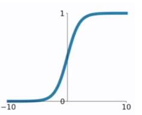
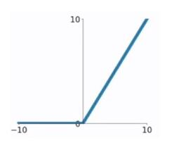
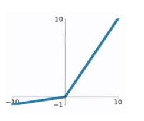

# 为什么需要激活函数？
1. 激活函数对模型学习、理解非常复杂和非线性的函数具有重要作用。
2. 激活函数可以引入非线性因素。如果不使用激活函数，则输出信号仅是一个简单的线性函数。线性函数一个一级多项式，线性方程的复杂度有限，从数据中学习复杂函数映射的能力很小。没有激活函数，神经网络将无法学习和模拟其他复杂类型的数据，例如图像、视频、音频、语音等。
3. 激活函数可以把当前特征空间通过一定的线性映射转换到另一个空间，让数据能够更好的被分类。

# 为什么激活函数需要非线性函数？
1. 假若网络中全部是线性部件，那么线性的组合还是线性，与单独一个线性分类器无异。这样就做不到用非线性来逼近任意函数。
2. 使用非线性激活函数 ，以便使网络更加强大，增加它的能力，使它可以学习复杂的事物，复杂的表单数据，以及表示输入输出之间非线性的复杂的任意函数映射。使用非线性激活函数，能够从输入输出之间生成非线性映射。
   
# 如何选择激活函数
&emsp;&emsp;选择一个适合的激活函数并不容易，需要考虑很多因素，通常的做法是，如果不确定哪一个激活函数效果更好，可以把它们都试试，然后在验证集或者测试集上进行评价。然后看哪一种表现的更好，就去使用它。
1. 如果输出是 0、1 值（二分类问题），则输出层选择 sigmoid 函数，然后其它的所有单元都选择 Relu 函数。
2. 如果在隐藏层上不确定使用哪个激活函数，那么通常会使用 Relu 激活函数。有时，也会使用 tanh 激活函数，但 Relu 的一个优点是：当是负值的时候，导数等于 0。
sigmoid 激活函数：除了输出层是一个二分类问题基本不会用它。
3. tanh 激活函数：tanh 是非常优秀的，几乎适合所有场合。
4. ReLu 激活函数：最常用的默认函数，如果不确定用哪个激活函数，就使用 ReLu 或者 Leaky ReLu，再去尝试其他的激活函数。
5. 如果遇到了一些死的神经元，我们可以使用 Leaky ReLU 函数。  

&emsp;&emsp;就我个人使用经验而言，非输出层一般使用Relu，复杂网络也会考虑Leaky Relu，输出层：如果是二分类，sigmoid无疑了（当然也可以用softmax），多分类则是softmax。

# 激活函数分类
在神经网络计算中，输入X会先进行一个线性变换，

$$ y = W · X + b $$

之后再进行一个非线性变换，即是y通过一个非线性的激活函数：
$$ output=g(y) $$

$g(y)$ 为非线性激活函数。  

1. sigmoid函数  
    sgmoid函数的计算公式为：  

    $$ g(x)= \frac{1} {1 + e^{-x} }  $$

    sigmoid函数缺点：当 x 值非常大或者非常小时，通过上图我们可以看到，sigmoid函数的导数 $g′(x)$ 将接近 0 。这会导致权重 W 的梯度将接近 0 ，使得梯度更新十分缓慢，即梯度消失。

  

2. tanh函数  
   tanh函数的计算公式为:
   $$ g(x) = \frac{e^{x} - e^{-x}}{e^{x} + e^{-x}}  $$  
   tanh函数的缺点同sigmoid函数的第一个缺点一样，当 x 很大或很小时，$g′(x)$ 接近于 0 ，会导致梯度很小，权重更新非常缓慢，即梯度消失问题。

3. ReLU函数  
   ReLU函数计算公式为：  
    $$ 
    g(x) = \left\{
        \begin{array}{rcl}
            x   &&  {x > 0} \\
            0   &&  {x \le 0} 
        \end{array} \right. 
    $$
    ReLU函数的优点：
    - 在输入为正数的时候（对于大多数输入 x 空间来说），不存在梯度消失问题。
    - 计算速度要快很多。ReLU函数只有线性关系，不管是前向传播还是反向传播，都比sigmod和tanh要快很多。sigmod和tanh要计算指数，计算速度会比较慢。  
  
    ReLU函数的缺点：
    - 当输入为负时，梯度为0，会产生梯度消失问题。

4. Leaky ReLU函数  
   Leaky Relu函数计算公式：
    $$ 
    g(x) = \left \{
        \begin{array}{cl}
            x   &&  {x > 0} \\
            \alpha \times x   &&  {x \le 0} 
        \end{array}
        \right. 
    $$
    其中，$\alpha$为一个比较小的非负数。  
    Leaky ReLU函数解决了ReLU函数在输入为负的情况下产生的梯度消失问题。

